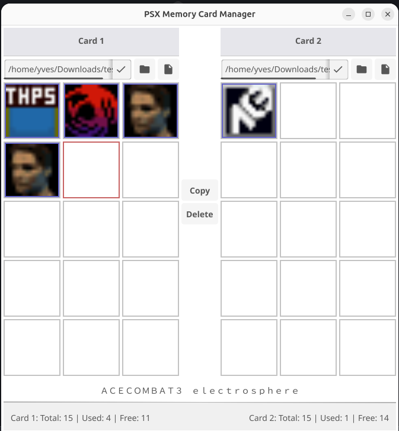

# PSX Memory Card Manager

A desktop application for managing PlayStation (PSX) memory card files, inspired by the classic PlayStation system menu memory card editor. Built with Go and Fyne UI framework.



## Goal

The goal of this project is to recreate the functionality of the PlayStation memory card file image editor that existed in the system menu of the classic PlayStation console. This tool allows you to manage `.mcr` memory card files on your computer, providing a familiar interface for viewing, organizing, and manipulating save game data.

## Features

### Core Functionality

- **Dual Memory Card View**: Display and manage two memory card files side-by-side, just like the original PlayStation interface
- **Block Visualization**: View all 15 blocks of each memory card in a 3×5 grid layout
- **Animated Icons**: Display save game icons with animation support, matching the original PlayStation experience
- **Save Game Information**: View save game titles and metadata for selected blocks
- **Block Statistics**: Real-time display of total, used, and free blocks for each memory card

### Memory Card Operations

- **Load Memory Cards**: Open and display existing `.mcr` memory card files
- **Create New Memory Cards**: Generate new, properly formatted empty memory card files
- **Copy Blocks**: Copy save game blocks from one memory card to another
- **Delete Blocks**: Remove save game blocks from memory cards
- **File Management**: Browse and select memory card files with an intuitive file picker

### User Interface

- **Classic PlayStation Aesthetic**: Styled headers and layout reminiscent of the original PlayStation interface
- **Visual Feedback**: Clear indication of selected blocks and memory card states
- **Placeholder Information**: Helpful placeholder text when no block is selected
- **Responsive Layout**: Footer stays anchored at the bottom, adapting to window resizing

## Screenshot

The application provides a clean, intuitive interface with:

- Two memory card slots (Card 1 and Card 2) displayed side-by-side
- File pickers for each card with browse and create new card buttons
- Block grids showing save game icons and allocation status
- Action buttons (Copy, Delete) in the center column
- Selected save game information area
- Footer displaying block statistics for both cards

## Installation

### Prerequisites

- Go 1.24 or later
- Fyne UI framework dependencies (automatically installed via `go mod`)

### Building from Source

This section describes how to build the application from source code locally.
Ensure you have Go (1.24 or later) installed and set up on your machine.

#### 1. Clone the repository

First, fetch the source code and move into the project root:

```bash
git clone <repository-url>
cd go-psx-memcard
```

#### 2. Install dependencies

All dependencies are managed via Go modules. To download them, run:

```bash
go mod download
```

#### 3. Build the application

You can build the application using the Go command:

 ```bash
 go build -o bin/psx-memcard ./main.go
 ```

 Or use the Makefile:

```bash
 make build
```

#### 4. Run the application

```bash
./bin/psx-memcard
```

## Usage

### Loading a Memory Card

1. Click the folder icon (📁) next to the file path field for Card 1 or Card 2
2. Browse and select a `.mcr` memory card file
3. The memory card will be loaded and its blocks displayed in the grid

### Creating a New Memory Card

1. Click the file icon (📄) next to the file path field
2. Choose a location and filename for the new memory card
3. A new, empty, formatted memory card file will be created

### Copying a Block

1. Select a block from one memory card by clicking on it
2. Click the "Copy" button
3. The selected block will be copied to the opposite memory card (if space is available)

### Deleting a Block

1. Select a block from a memory card
2. Click the "Delete" button
3. The block will be removed from the memory card

### Viewing Block Information

- Click on any block to view its save game title in the information area
- The footer shows real-time statistics: total blocks, used blocks, and free blocks for each card

## Architecture

The application follows a **Model-View-ViewModel (MVVM)** pattern:

- **View Layer**: Fyne UI components for rendering
- **ViewModel Layer**: Manages UI state and coordinates operations
- **Domain Layer**: Core business logic for PSX memory card format

For detailed architecture documentation, see [architecture.md](architecture.md).

## Memory Card Format

The application supports the standard PlayStation memory card format (`.mcr` files):

- 128 KB total size (131,072 bytes)
- 15 data blocks (8 KB each)
- Header frames, directory frames, and block data
- Shift-JIS encoded save game titles
- 16×16 pixel animated icons

For more information about the PSX memory card format, see the [official documentation](https://problemkaputt.de/psxspx-memory-card-data-format.htm).

## Development

### Running Tests

```bash
go test ./...
```

### Code Formatting

```bash
go fmt ./...
```

## License

This project is licensed under the MIT License - see the [LICENSE](LICENSE) file for details.

## Acknowledgments

- Inspired by the classic PlayStation memory card management interface
- Built with [Fyne](https://fyne.io/) - a cross-platform GUI framework for Go
- Memory card format documentation: [PSX-SPX Memory Card Data Format](https://problemkaputt.de/psxspx-memory-card-data-format.htm)
